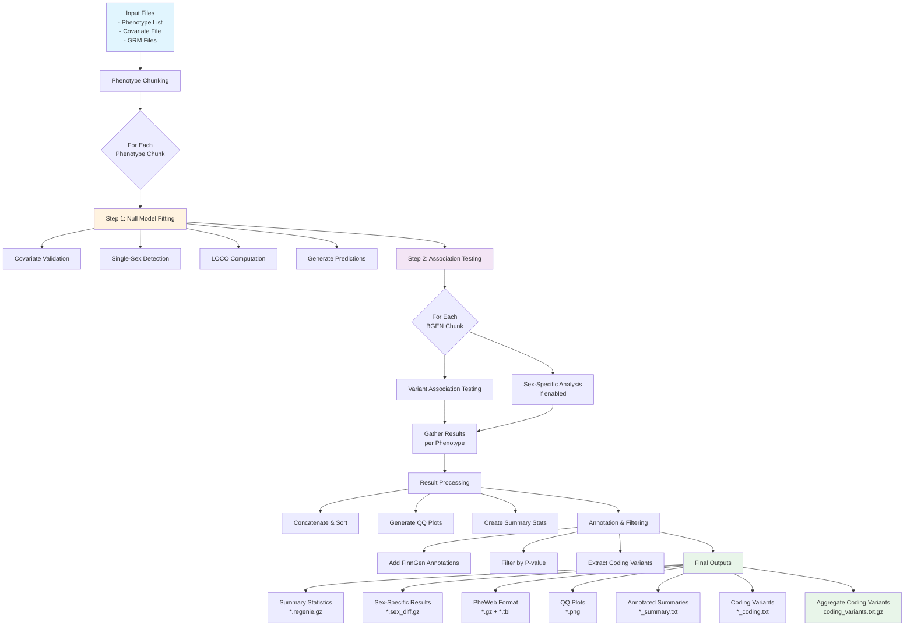

# regenie-pipelines
WDL pipelines for running regenie

See regenie [documentation](https://rgcgithub.github.io/regenie/options/) and [paper](https://www.biorxiv.org/content/10.1101/2020.06.19.162354v2.full.pdf)

## Building docker image

The current version of regenie has the modifications created in the finngen repo, so it can be used to build the docker image. We want to build with Boost iostream for compression support, and with intel MKL as the linear algebra package.

Build image with [build_docker.sh](scripts/build_docker.sh). Give tag with version (e.g. FG_1.1) as parameter.
Check the beginning of scripts for modifying the default behavior with few variables (e.g. not building base regenie but basing off of already built one)
The parameter is just name tag to be added to the base regenie docker name. Change versioning as needed.


## Running GWAS

How to run regenie GWAS with Cromwell
This in an example scenario creating new phenotypes with R7 data and running those

1. Create a covariate/phenotype file that contains your phenotypes. E.g. get `gs://r7_data/pheno/R7_COV_PHENO_V2.txt.gz`, add phenotypes to that (if a binary phenotype: cases 1, controls 0, everyone else NA - if a quantitative phenotype: inverse rank normalized values), and upload the new file to a bucket. Note that the phenotype file should be tab-separated with no spaces as both are treated as separator in regenie.
2. Create a text file with the names of your new phenotypes
    2.1. If you have one or a few phenotypes, create a file with one phenotype per line, e.g.
    my_phenos.txt
    ```
    PHENO1
    PHENO2
    ```
    and upload the file to a bucket.
    2.2. If you have a larger number of phenotypes, create a tab-separated file where each line contains phenotypes that have < 5 % non-shared missingness. For example, if you have PHENO{1:5} that are female phenotypes (all males are NA and will be excluded as shared missingness) and they have < 5 % non-shared missingness among the females, and PHENO{6:7} that are male phenotypes with < 5 % non-shared missingness among the males, you can do:
    my_phenos.txt
    ```
    PHENO1  PHENO2  PHENO3  PHENO4  PHENO5
    PHENO6  PHENO7
    ```
    and upload the file to a bucket. Phenotypes on each row will be analyzed together as regenie step 1 is faster that way. Non-shared missing phenotypes for phenotypes on each row will be mean-imputed for level 0 regression and this is why the phenotypes on each row should have low non-shared missingness. It's recommended to analyze at most 8 phenotypes together because the number of vCPUs used grows with the number of phenotypes and we've observed high preemption rates with VMs with more than 8 vCPUs.
3. Clone this repo: `git clone https://github.com/FINNGEN/regenie-pipelines`
4. Edit the input file `regenie-pipelines/wdl/gwas/regenie.json`:
    5.1. Change `regenie.cov_pheno` to the file you created in the first step
    5.2. Change `regenie.phenolist` to the file you created in the second step
    5.3. `regenie.is_binary` should be `true` for binary phenotypes and `false` for quantitative phenotypes
    5.4. `regenie.sub_step2.step2.test` can be `additive`, `recessive` or `dominant` depending on which analysis you want to run
    5.5. Change `regenie.covariates` and `regenie.sub_step2.step2.options` as needed

    5.6.
    "regenie.auto_remove_sex_covar": true,
    "regenie.sex_col_name": "SEX_IMPUTED",
    "regenie.sub_step2.run_sex_specific": true,
    "regenie.sub_step2.step2.sex_specific_logpval": 6,

5. Cromwell requires subworkflows be zipped: `cd regenie-pipelines/wdl/gwas/ && zip regenie_sub regenie_step1.wdl regenie_sub.wdl`
6. Connect to Cromwell server
    `gcloud compute ssh cromwell-fg-1 --project finngen-refinery-dev --zone europe-west1-b -- -fN -L localhost:5000:localhost:80`
7. Submit workflow
    7.1. With `https://github.com/FINNGEN/CromwellInteract`
    7.2. Or using the web interface
        7.2.1 Go to `http://0.0.0.0:5000` with your browser
        7.2.2 Click `/api/workflows/{version}`
        7.2.3 Choose `regenie.wdl` as workflowSource
        7.2.4 Choose the edited `regenie.json` as workflowInputs
        7.2.5 Choose `regenie_sub.zip` as workflowDependencies
        7.2.6 `Execute`
8. Use the given workflow id to look at the timing diagram or to get metadata
`http://0.0.0.0:5000/api/workflows/v1/WORKFLOW_ID/timing`
`http://0.0.0.0:5000/api/workflows/v1/WORKFLOW_ID/metadata`
9. Logs and results go under
`gs://fg-cromwell_fresh/regenie/WORKFLOW_ID`
Summary stats and tabix indexes:
`gs://fg-cromwell_fresh/regenie/WORKFLOW_ID/call-sub_step2/**/call-gather/**/*.gz*`
Plots:
`gs://fg-cromwell_fresh/regenie/WORKFLOW_ID/call-sub_step2/**/*.png`
Summary files with p < 1e-6 variants including annotation:
`gs://fg-cromwell_fresh/regenie/WORKFLOW_ID/call-sub_step2/**/call-summary/**/*_summary.txt`

## Detailed Pipeline Architecture and Flow

The regenie GWAS pipeline is designed to efficiently perform genome-wide association studies using a two-step approach. Here's a comprehensive breakdown of what happens at each stage:

### Pipeline Overview

The pipeline follows a scatter-gather pattern to parallelize computations across phenotypes and genomic regions. It consists of two main steps:

1. **Step 1**: Null model fitting and covariate processing
2. **Step 2**: Association testing across the genome

### Step-by-Step Process

#### 1. Input Processing and Phenotype Chunking
- The pipeline reads the phenotype list file (`phenolist`)
- Phenotypes are grouped into chunks for efficient processing
- Each chunk contains phenotypes with < 5% non-shared missingness to enable mean imputation

#### 2. Step 1: Null Model Fitting (regenie_step1)
For each phenotype chunk, Step 1 performs:

- **Covariate Validation**:
  - Checks if covariates meet the inclusion threshold (minimum 10 samples by default)
  - Automatically removes sex covariate for single-sex phenotypes if configured
  - Filters out covariates with insufficient variation

- **Single-Sex Detection**:
  - Determines if phenotypes are single-sex (all samples are either male or female)
  - This information is used to adjust downstream analyses

- **Null Model Computation**:
  - Uses the Genetic Relationship Matrix (GRM) to account for population structure
  - Fits a null model using LOCO (Leave-One-Chromosome-Out) approach
  - Generates predictions and null model files for Step 2

- **Outputs**:
  - `.loco.gz` files: LOCO predictions for each chromosome
  - `.pred.list`: List of prediction files
  - `.firth.gz` and `.firth.list`: Firth regression files for binary traits
  - Covariate list used in the analysis

#### 3. Step 2: Association Testing (regenie_step2)
Step 2 is scattered across multiple BGEN files (genomic chunks):

- **Genetic Association Testing**:
  - Tests each variant for association with phenotypes
  - Supports additive, dominant, and recessive models
  - Uses Firth regression for binary traits to handle case-control imbalance
  - Applies the null model from Step 1 to adjust for covariates and population structure

- **Sex-Specific Analysis** (if enabled):
  - Performs separate analyses for males and females
  - Calculates sex-differentiated effects
  - Tests for significant differences between sexes

- **Parallel Processing**:
  - Each BGEN chunk is processed independently
  - Results are generated for each phenotype-chunk combination

#### 4. Gather and Post-Processing
For each phenotype, the pipeline:

- **Result Gathering**:
  - Concatenates results from all genomic chunks
  - Sorts by chromosome and position
  - Creates both regenie format and PheWeb format outputs

- **Sex-Specific Result Processing**:
  - Merges male and female results
  - Calculates differential effects between sexes
  - Generates sex-specific summary files

- **Quality Control**:
  - Generates QQ plots for visual inspection
  - Calculates genomic inflation factors
  - Creates quantile files for downstream analysis

#### 5. Summary and Annotation
The final step annotates significant results:

- **Variant Annotation**:
  - Adds FinnGen-specific annotations (gene, consequence, rsID)
  - Includes functional annotations from gnomAD
  - Filters results based on p-value thresholds

- **Output Generation**:
  - Summary files for variants with p < 1e-6
  - Coding variant files for p < 1e-4 in protein-coding regions
  - Tabix-indexed files for efficient querying

#### 6. Final Aggregation
- All coding variants across phenotypes are gathered into a single file
- Results are organized in the output bucket with clear directory structure

### Pipeline Flow Diagram



### Key Features

1. **Efficiency**:
   - Parallel processing across phenotypes and genomic regions
   - Smart chunking to balance computational load
   - Preemptible instances for cost optimization

2. **Robustness**:
   - Automatic covariate filtering
   - Single-sex phenotype detection
   - Firth regression for rare variants

3. **Comprehensive Analysis**:
   - Sex-specific effects when relevant
   - Multiple genetic models (additive, dominant, recessive)
   - Rich annotations for interpretation

4. **Quality Control**:
   - QQ plots for each phenotype
   - Genomic control metrics
   - Filtering based on statistical significance

This architecture ensures scalable, reproducible, and comprehensive genome-wide association analyses across the FinnGen dataset.


## FINNGEN CONDITIONAL ANALYSIS

This is a wrapper pipeline of [regenie](https://rgcgithub.github.io/regenie/) for conditional analysis. The pipeline is mainly built a single python [script](scripts/regenie_conditional.py) that iteratively runs the conditional analysis of regenie until no significant hits are found anymore. The wdl is meant for release purposes and will run all hits from a list of phenos and chromosomes based on the official Finngen results.

### regenie_conditional.py

This is the "engine" of the pipeline, that can also be used independently, so I will first explain its mechanism and inputs.

These are the parameters:
```
optional arguments:
  -h, --help            show this help message and exit
  --pval-threshold PVAL_THRESHOLD
                        Threshold limit (-log(mpval))
  --pheno PHENO         Pheno column
  --out OUT             Output Directory and prefix (e.g. /foo/bar/finngen)
  --covariates COVARIATES
                        List of covariates
  --pheno-file PHENO_FILE
                        Path to pheno file
  --bgen BGEN           Path to bgen
  --sample-file SAMPLE_FILE
                        Path to pheno file
  --sumstats SUMSTATS   Path to original sumstats
  --regenie-params REGENIE_PARAMS
                        extra bgen params
  --null-file NULL_FILE
                        File with null info.
  --force               Flag for forcing re-run.
  -log {critical,error,warn,warning,info,debug}, --log {critical,error,warn,warning,info,debug}
                        Provide logging level. Example --log debug',
                        default='warning'
  --max-steps MAX_STEPS
  --chr_col CHR_COL, --chr-col CHR_COL
  --pos_col POS_COL, --pos-col POS_COL
  --ref_col REF_COL, --ref-col REF_COL
  --alt_col ALT_COL, --alt-col ALT_COL
  --mlogp_col MLOGP_COL, --mlogp-col MLOGP_COL
  --beta_col BETA_COL, --beta-col BETA_COL
  --sebeta_col SEBETA_COL, --sebeta-col SEBETA_COL
  --threads THREADS     Number of threads.
  --locus-region LOCUS_REGION LOCUS_REGION
                        Locus & Region to filter CHR:START-END
  --locus-list LOCUS_LIST
                        File with list of locus and regions
```

They are all quite self explanatory. By default all cpus are used and the logging level is set to `warning`.

The null files are the `*loco.gz` outputs of regenie step 1. The last two inputs are mutually exclusive and are meant for defining the regions of choice. The vanilla mode runs just one region/locus (in any order and in regenie format, e.g. `6:34869517-37869517 chr6_35376598_G_A`). The script will automatically recognize which is the locus and which the region. Else one can pass a file with a tsv separated list of regions/locuses, one per line. The script will then run the main function for each region/locus.

Each run will iteratively condition on more and more significant variants until no hits are found under a certain threshold (`pval-threshold`, either a mlogp > 1 or a pval <1, it gets converted to mglop anyways). One can also choose to cap the iterations at a certain thershold (`max-steps`) instead.

`regenie_params` are the extra parameters to pass to regenie. By default ` ' --bt --bsize 200  '` are passed, but `--ref-first` is also required with FG data.

The outputs will be in the `--out` directory (generated if missing). Along with a temporary folder that contains all the necessary files, the outputs are:
- prefix*_pheno_locus.log: the stdout/err of regenie is appended to this file so all logs are available
- prefix*_pheno_locus.independent.snps: contains the chain of results
- prefix*_pheno_locus_STEP.conditional: the regenie output of each of the [1..N] steps of the chain.

### WDL

Here I will explain the tasks and inputs of the [wdl](wdl/conditional-analysis/regenie_conditional_full.wdl)

#### Inputs

Global inputs:
```
"conditional_analysis.docker": "eu.gcr.io/finngen-refinery-dev/conditional_analysis:r9.4 ",
#"conditional_analysis.regenie_conditional.regenie_docker": "eu.gcr.io/finngen-refinery-dev/conditional_analysis:r9.2 ", (optional to avoid to rerun previous tasks)

"conditional_analysis.phenos_to_cond": "gs://r9_data/pheno/R9_analysis_endpoints_with_quants.txt",
"conditional_analysis.chroms": ["1", "2", "3", "4", "5", "6", "7", "8", "9", "10", "11", "12", "13", "14", "15", "16", "17", "18", "19", "20", "21", "22","23"],
"conditional_analysis.pheno_file": "gs://r9_data/pheno/R9_COV_PHENO_V1.FID.txt.gz",

"conditional_analysis.release": "9",
"conditional_analysis.locus_mlogp_threshold": 7.3,
"conditional_analysis.conditioning_mlogp_threshold": 6,

"conditional_analysis.sumstats_root": "gs://r9_data/regenie/release/output/summary_stats/PHENO.gz",
"conditional_analysis.mlogp_col": "mlogp",
"conditional_analysis.chr_col": " '#chrom' ",
"conditional_analysis.pos_col": "pos",
"conditional_analysis.ref_col": "ref",
"conditional_analysis.alt_col": "alt",
 ```
 `phenos_to cond` and `chroms` determine what phenos and what chrom regions are run. This can be handy to run shorter/test runs.
 `pheno_file` is the file that contains all pheno related data. It has to have the FID column and contain the covariates.
 `release` is added as a suffix to all pipeline outputs.
 `sumstats_root` is the standard regenie output of Finngen from which the top hits are chosen. The following list of header inputs (`mlogp_col`,`chr_col` etc) have to match the content of the sumstats files.

 `locus_mlogp_threshold` determines the threshold for choosing the starting locuses (extracted from sumstats).
 `conditioning_mlogp_threshold` instead is the parameter used to stop the regenie chain conditional run.

 ### filter_covariates
 This is a preprocessing task. It generates for each pheno the list of valid covariates to be passed to regenie. It checks that for each group of input phenos (in this case each pheno is its own group) there are at least N counts of non NA samples *and* non 0 covariates. The output of the task is a pheno--> covariates map object that is then passed to regenie later.


 ```
 "conditional_analysis.filter_covariates.threshold_cov_count": 10,
 "conditional_analysis.covariates": ["PC1", "PC2", "PC3", "PC4", "PC5", "PC6", "PC7", "PC8", "PC9", "PC10", "SEX_IMPUTED", "AGE_AT_DEATH_OR_END_OF_FOLLOWUP", "IS_FINNGEN2_CHIP", "BATCH_DS1_BOTNIA_Dgi_norm", "BATCH_DS10_FINRISK_Palotie_norm", "BATCH_DS11_FINRISK_PredictCVD_COROGENE_Tarto_norm", "BATCH_DS12_FINRISK_Summit_norm", "BATCH_DS13_FINRISK_Bf_norm", "BATCH_DS14_GENERISK_norm", "BATCH_DS15_H2000_Broad_norm", "BATCH_DS16_H2000_Fimm_norm", "BATCH_DS17_H2000_Genmets_norm", "BATCH_DS18_MIGRAINE_1_norm", "BATCH_DS19_MIGRAINE_2_norm", "BATCH_DS2_BOTNIA_T2dgo_norm", "BATCH_DS20_SUPER_1_norm", "BATCH_DS21_SUPER_2_norm", "BATCH_DS22_TWINS_1_norm", "BATCH_DS23_TWINS_2_norm", "BATCH_DS24_SUPER_3_norm", "BATCH_DS25_BOTNIA_Regeneron_norm", "BATCH_DS3_COROGENE_Sanger_norm", "BATCH_DS4_FINRISK_Corogene_norm", "BATCH_DS5_FINRISK_Engage_norm", "BATCH_DS6_FINRISK_FR02_Broad_norm", "BATCH_DS7_FINRISK_FR12_norm", "BATCH_DS8_FINRISK_Finpcga_norm", "BATCH_DS9_FINRISK_Mrpred_norm"],
```

#### extract_cond_regions

This task returns the top hits for each pheno, under the previously defined threshold. The only required input are the finemap regions that are produced by our pipeline. The task filters the input sumstats (tabix file is to be expected!) to the finemap region limits and proceeds to return the lowest pvalue in the region. If the threshold is too low the task will not fail as a file with header only will be generated regardless.

```
"conditional_analysis.extract_cond_regions.region_root": "gs://r9_data/finemap/release/regions/PHENO.bed",
```

### merge_regions
Pretty self explanatory task. All regions from the previous task are merged into a single input file over which we will scatter the regenie runs.

#### regenie_conditional
This is the major task where the magic happens. For reference, the shards will take between 30mins to ~1h30 mins (assuming no pre-emption) depending on localization times and length of chain.
 ```
    #REGENIE
    "conditional_analysis.regenie_conditional.bgen_root": "gs://r9_data/conditional_analysis/bgen/finngen_R9_annotated_CHROM.bgen",
    "conditional_analysis.regenie_conditional.null_root": "gs://r9_data/regenie/release/output/nulls/R9_GRM_V1_LD_0.1.PHENO.loco.gz",
    "conditional_analysis.regenie_conditional.sebeta": "beta",
    "conditional_analysis.regenie_conditional.beta": "sebeta",
    "conditional_analysis.regenie_conditional.max_steps": 10,
    "conditional_analysis.regenie_conditional.regenie_params": " ' --bt --bsize 200 --ref-first ' ",
    "conditional_analysis.regenie_conditional.cpus": 4,

```
`bgen_root` is the path to the bgens, where a `.bgen.sample` is expected to be found as well!
`null_root` are the step1 outputs.
`beta` and `se_beta` are the column names for the entries in the sumstat file.
`max_steps` controls the maximum length of the chain.
`regenie_params` are all the other flags to be passed to regenie.
`cpus` is self explanatory.

### PHEWEB IMPORT

The last munging step has been problematic lately due to the number of files needed to be munged. For this scenario there is, if needed, a separated `pheweb_import.wdl` that reproduces the last step of the wdl by dealing with the files in chunks. The relevant inputs are the list of paths for conditional chains and regenie outputs that are part of the release anyways.